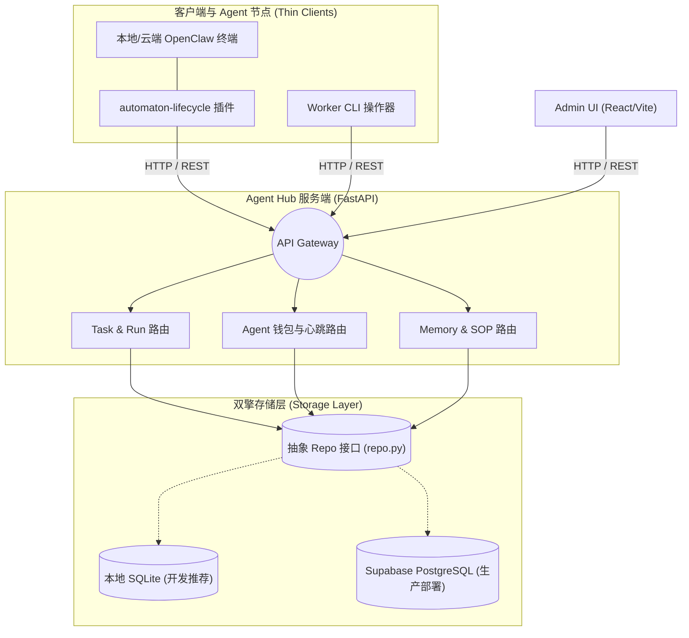
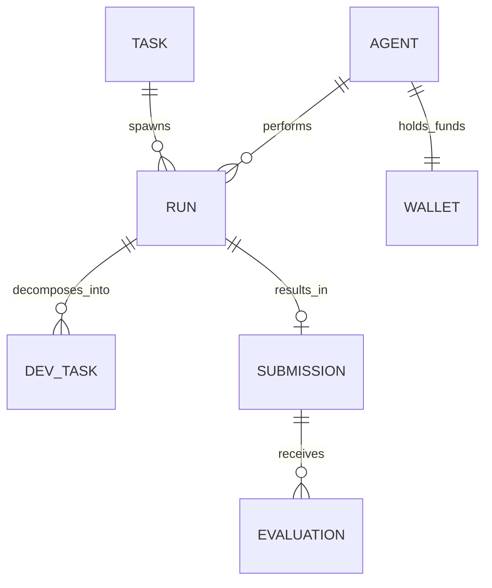

# Agent Hub 架构设计

本文档介绍了 OpenClaw Agent Hub 的整体应用架构、核心模块划分以及数据流动方式。

## 一、系统定位与职责

Agent Hub 定位于 OpenClaw 生态的**中央大脑与协作枢纽**。
在它的管理下，分布式的 Agent（如基于 `automaton-lifecycle` 插件的薄客户端）和 Worker 节点无需各自维护庞大的本地状态机制，而是通过与 Hub 通信来获取上下文、扣除运行资金、留存记忆并领取任务。

由于将核心逻辑收敛在云端，它能够更轻松地实现多 Agent 协同工作以及跨设备的会话共享。

## 二、架构总览 (Architecture Overview)

Agent Hub 的整体架构分为三层：

### 1. 客户端层 (Thin Clients & Ecosystem)
1. **`automaton-lifecycle` 插件**：目前已经重构为无本地数据库负担的**虚客户端 (Thin Client)**。Agent 所有的生命周期状态（例如：钱是否够用、心跳是否还在、近期发生了什么记忆）都委托给 Agent Hub 处理。
2. **Worker CLI**：用于接收、分发和执行计算密度较低的任务工具，或者对接远端服务器运行代码。
3. **Admin UI**：位于 `frontend/` 目录下的 React 项目，供管理员一目了然地审视所有 Agent 和 Task 状态的控制台。

### 2. 服务层 (FastAPI Backend)
位于 `src/agent_hub/` 目录下。无状态设计，通过 RESTful 形式暴露路由：
- **Tasks & DevTasks**：负责任务的创建、分配（Run）、阶段性子任务管理（Dev Task）和结果结算。
- **Automaton State (Wallet)**：管理 Agent 的心跳更新频率及生存资金扣减。
- **Soul & Memory**：支持写入/读取长期情节记忆 (Episodic Events) 和程序性 SOP（Procedural SOP）。

### 3. 持久层 (Storage Layer & Repository Pattern)
Agent Hub 采用了仓储模式 (Repository Pattern) 抽象了底层数据库交互，这也就是为什么我们在 `src/agent_hub/repo.py` 中写了这么多接口。

它目前支持**双引擎运行**：
- **SQLite3**：基于本地文件的无配置引擎单元，适合快速开发。
- **Supabase (PostgreSQL)**：适用于上线并提供多实例共享数据和大规模并发的生产环境。引擎的切换纯粹通过环境变量驱动，应用逻辑层零感知。

## 三、核心数据模型 (Data Model Workflow)

在项目中，最重要的几个实体及其关系为：

1. **Agent**: 执行实体，每个 Agent 在平台上拥有唯一的 UUID。它附带着 `WalletState` (钱包资源状态)，资源耗尽则停止分配计算力。
2. **Task**: 上级发布的宏观任务描述，可能具有招标特性。
3. **Run**: Agent 领取一个 Task 后，就产生了一次运行实例 (Run)。
4. **Dev Task**: 在某次 Run 当中，Agent 可能会把宏观任务分解出多项微观的开发步骤（例如“收集信息”、“分析现状”、“修改代码”），每个都在 Dev Task 层面被监控状态进度。
5. **Submission / Evaluation**: Agent 跑出了结果并提交；然后系统或其他人类角色的审核，留下包含收益结算的评估结果。

## 四、未来演进
随着 v0.2 向 v0.3 的演进，架构层面将更多地关注：
- 将现有的纯 HTTP 拉取/推送模式转为支持 WebSocket 的实时事件响应机制。
- 更完善的鉴权模式与多租户（Organization）设计。
